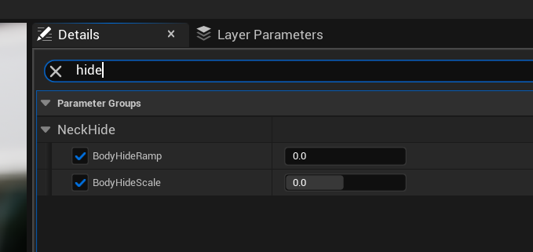
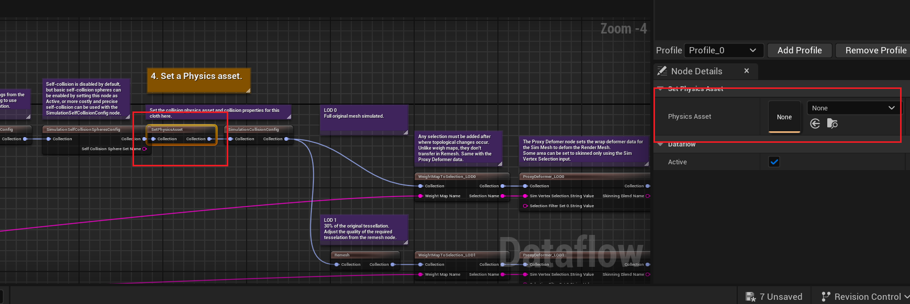

# MetaHuman生产流程
## 创建
### MetaHuman Identify
1. 照片(LiveLinkFace)或扫描()形式创建Identify
2. 简单设置五官位置、选择体型
3. 在MetaHumanCreator进行初步脸型调整

## 修改
### 环境准备
1. 在Bridge中下载MetaHuman，找到并复制DNA文件(不要修改原DNA文件，以防止修改失败导致MetaHuman丢失)
2. 下载Maya2022（或Maya2023）
3. 下载[MetaHuman-DNA-Calibration](https://github.com/EpicGames/MetaHuman-DNA-Calibration)
4. 找到系统环境变量，新增环境变量，并重启（其中变量值为下载的Calibration路径）

### 工具脚本
新增各类Python插件时,打开Maya脚本编辑器，在脚本编辑器中输入以下代码，修改第十六行的Maya版本（为方便下次打开，全选代码，鼠标中键拖入‘自定义’栏中）

### 脸部修改流程
#### 下载MetaHuman
通过Bridge客户端版本下载对应的MetaHuman，注意下载Maya插件与导出设置

#### 工具初始化
1. 将[工具脚本](scripts/tools_main.py)放进Maya脚本编辑器中并执行
2. 根据弹出的提示,先选择MetaHuman-DNA-Calibration文件夹,再选择一个存放生产文件的工作文件夹(注意,确保所选的MetaHuman-DNA-Calibration文件夹已经在系统环境变量中配置)

3. 选择完成后看到插件主界面则工具启动成功

#### 制作UE需要的骨骼
1. 在Bridge下载的文件夹中找到类似下图命名的Maya文件，复制一份并打开

2. 删除图中所示的组

3. 选中`root`或带有命名空间的root骨骼，点击"删除约束"按钮，取消root上的约束
4. 删除如图所示选中的内容，保留脸部所需基础骨架,并另存为新Maya Ascii文件

#### 脸部修改
1. 点击插件上基础操作部分中的`打开DNA文件`按钮,选择Bridge下载过的MetaHumanDNA,建议在此之前拷贝一份 
2. 点击`保存顶点关节位置信息`按钮,保存的文件你会在所选择的工作文件夹下的temp中看到 
3. 选择lod0组中需要修改的Mesh,并导出为obj文件,例如修改脸型,即选中head_lod0_mesh,点击文件导出当前选择.导出后的obj文件即可去到其他工具如ZBrush、Blender中修改（也可直接在maya里复制一个进行修改。！！！注意不要其拓扑，只做脸型修改）修改完成后仍保存为obj即可 
4. 将修改后的脸部模型拷贝至当前已打开的DNA下，并选中模型，点击`脸部模型匹配`按钮,你会看到对应面部的mesh已经修改,同时在工作空间里的dna目录下可以看到新增了一个MetaHuman_mesh.dna文件 
5. 点击`脸部关节匹配`按钮,将关节位置与模型匹配,你会看到关节位置与mesh匹配,同时与上相同目录下会新增一个MetaHuman_jnt.dna文件 
6. 如果需要进行脸部骨骼调整或面部表情夸张程度调整，如脖子长度、嘴角最大上扬程度等，可以点击`允许骨骼编辑`按钮进入骨骼编辑模式，骨骼修改通过拉伸对应骨骼，表情夸张程度通过调节MetaHuman控制面板。修改完成后点击`保存骨骼编辑`将骨骼信息写入DNA，在工作空间里的dna目录下会生成一个MetaHuman_rig.dna文件。
7. 点击`修改设置并生成DNA`按钮相关设置修改,并生成MetaHuman_final.dna文件
8. 点击`检查结果`按钮,将打开DNA Viewer,在这里可以预览结果并观察是否可以控制修改后的关节 
9. 点击`导出脸部FBX`按钮,在弹出的选择框中选中之前制作的脸部基础骨架,点击确认将会在工作空间output目录下生成脸部各lod级别的模型 
#### 导入UE
1. 通过Bridge下载MetaHuman到对应的UE工程,并找到其位置,分别拷贝一份身体蓝图与脸部骨骼网格体作为对比(如确定修改,忽略拷贝步骤)
2. 找到引擎设置,搜索reimport,勾选图中框选的部分 
3. 找到脸部骨骼网格体,在详细面板里找到导入设置->文件目录,点击添加刚刚导出的FBX文件 
4. 点击如图示的按钮,替换LOD0的网格体,导入设置时先重置为默认,在将骨骼选中为Face_Archetype_Skeleton  
5. 找到LOD设置,分别替换LOD1-7的网格并保存 
6. 在脸部所在目录中右键,导入最终的DNA文件MetaHuman_final.dna 
7. 替换蓝图中脸部的骨骼骨骼网格体,导入完成 
#### 调整
1. 替换了脸部骨骼网格体后,你会看到毛发位置不正确,这是因为绑定资产已经修改,需要对其进行手动修改 
2. 在进行脸部表情修改时，可以在Maya的融合变形中修改其起始点和结束点脸部顶点位置，以达到对表情夸张程度的修改。例如修复闭眼时没有完全闭上，点击`允许骨骼编辑`，打开`形变编辑器`窗口，通过拖动场景中控制面板里的值，找到对应的BlendShape。点击`编辑`，修改眼皮在该权重下的顶点位置，再次点击`编辑`结束。此时再次拖动控制面板，查看结果是否正确。修改完成后点击`保存骨骼编辑`按钮，并生成MetaHuman_rig.dna文件。
 

### 身体修改流程
#### 骨骼调整
1. （重要！！！）点击"打开Maya工程"打开从Bridge中复制出来的body_rig.ma文件,查看身体Mesh的名称前缀是否与工具框中的一致，如果不一致，选中mesh，点击修改，将自动获取前缀。
2. 点击"保存平滑蒙皮值"按钮，将默认值保存到json文件
3. 删除图中选择的mesh，仅保留各LOD等级的身体

4. 对骨骼，蒙皮等进行自定义操作，这里选中驱动骨架对其进行整体目标缩放（记住缩放值）

6. 选中`root`或带有命名空间的root骨骼，取消root上的约束。
5. ctrl+d复制身体mesh，注意命名一致，并取消与组的关联，删除选中项

7. 选中root，观察右侧通道中是否已经是目标缩放值，在工具栏中找到冻结变换选项，并应用

8. 选中lod0的身体mesh，点击“加载平滑蒙皮值”按钮
9. 另存当前工程为Maya Ascii格式
10.  与脸部修改部分中“制作UE需要的骨骼”步骤相同，制作一个脸部骨骼文件，并同样另存工程为Maya Ascii格式

11. 点击“修改脸部骨骼缩放”按钮，在弹出的滑动条中输入刚刚对身体设置的缩放值并确认，紧接着选择需要进行缩放操作的DNA文件
12. 点击“导出缩放后的FBX”按钮，先后选择在第9、10步中保存的两个工程文件，会在工作空间output/scale目录下生成缩放后身体与脸部的FBX文件
#### 导入UE
1. 脸部导入部分与上面“脸部修改流程”中的一致
2. 找到身体骨骼网格体存放位置，拷贝一份作为对比（无需对比直接忽略拷贝步骤）
3. 同样先在导入设置里添加文件路径

4. 同样点击reimport with new file，但此处导入时会有弹窗提示，在第二列的格子中右键并选择弹出的选项使之变成绿色即可

5. 回到蓝图中替换身体的骨骼网格体即可

6. 最终预览结果

#### 调整
1. 如果身体出现贴图突出，需将材质中的BodyHideRamp与BodyHideScale选项取消勾选

## 衣服(Chaos Cloth)
### 导出流程
1. 在UE中导出MetaHuman全身模型，给到MD用于制作衣服提供模型参考。
2. 衣服制作完成，在MD UVEditor模式下对衣服的UV进行平铺调整，不要让其堆叠（方便UE中刷权重）
3. 在UVEditor中全选，点击工具栏中`文件->导出->USD`，选择一个存放位置后进行导出设置。主要需要注意三个选项：取消勾选`选择所有虚拟模特`、勾选`包括服装模拟信息`、设置`比例`为厘米。
4. 在Maya或者其他软件中对衣服权重进行调整，同样导出USD文件。
5. 回到UE，在插件中勾选ChaosClothAsset以及ChaosClothAssetEditor，并重启引擎。
6. 创建一个ClothAsset并打开，在Graph窗口中选中第一个节点`USDImport`，并在详细面板中导入USD文件。 
7. 选中第三个节点`TransferSkinWeights`，为其选择MetaHuman的身体骨骼网格体，同时在预览场景面板中也选择同样的骨骼网格体进行预览（注意暂时不要点击Accept进行应用，这一步主要用于调整衣服位置偏移的。如衣服不需要调整，则可以点击Accept进行下一步）
8. 一般情况下，在使用与制作衣服时相同的骨骼网格体情况下，衣服不会存在偏移，如果体型有修改变动，则需要手动调整。如图，假设衣服位置偏高，在左侧调整角色的位置，并记录下偏移值。直接取消掉当前操作，选择第二个节点`TransformPositions`，在右侧详细面板中选中3D Sim和Render，修改衣服偏移值（与角色反方向）。再回到步骤6中为其设置骨骼网格体。 
9. 在右侧预览面板中添加一个动作进行预览，如果衣服不需要添加其他模拟（例如牛仔裤，紧身衣等）则跳过这一步。如需进行布料模拟，选中第四个节点`AddWeightMap`，使用笔刷工具对需要进行布料模拟的部位进行权重绘制。
10. 选中`SetPhysicsAsset`节点，并在详细设置中添加当前骨骼网格体所使用的物理资产。
11. 详细流程见官方教程文档：[ChaosClothWorkFlow](https://dev.epicgames.com/community/learning/tutorials/pv7x/unreal-engine-cloth-panel-editor)

## 毛发(Groom)
### 毛发制作与导出流程
1. 在UE中或直接使用DNA导出MetaHuman脸部模型，给到Maya或其他软件制作毛发。
2. 毛发制作完成后，这里使用Maya XGen举例，首先需要设置首先需要选中描述将毛发转化为交互式梳理，然后点击导出缓存按钮，在设置中设置导出为`当前帧`，并勾选`写入最终宽度`。  
3. 回到UE中，在插件里开启`Groom`以及`Alembic Groom Importer`，并重启引擎。
4. 将导出的文件导入引擎，这里需要注意坐标转换问题。UE中坐标轴为X-Right，Y-Forward，Z-Up。Maya在使用完DNA插件后坐标轴为 X-Right，Y-Backward，Z-Up。那么在导入毛发时需要在导入设置中需要旋转Z轴180°，X缩放为-1。（这是在没有调整Maya角色旋转情况下）如果角色有在Maya中旋转了90°，那么对应的导入时还需要将X轴旋转-90°。如果Maya中Y轴朝上，则不需要调整角色旋转。   
5. 右键Groom，为其创建一个绑定，并选择MetaHuman的脸部作为其骨骼网格体。 
6. 在MetaHuman的蓝图中找到对应的部位，并将新的Groom及其绑定资产拖到对应位置，如果没有对应部位，则可以添加一个Groom组件到脸部下，并设置重置其位置和旋转。
7. 针对毛发的模拟（略，见官方参数文档[Groom资产编辑器用户指南](https://dev.epicgames.com/documentation/zh-cn/unreal-engine/groom-asset-editor-user-guide-in-unreal-engine)）